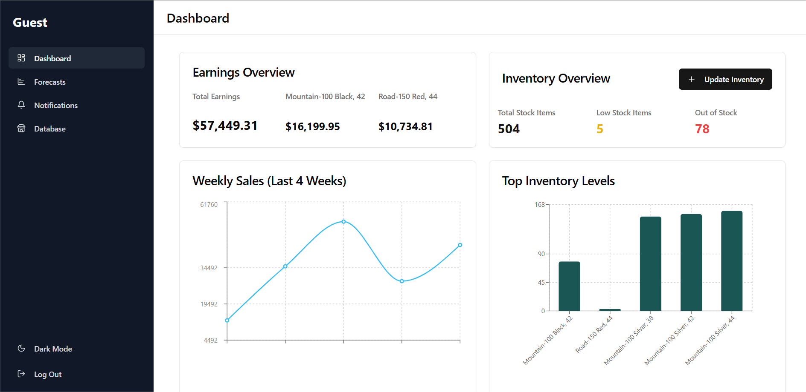
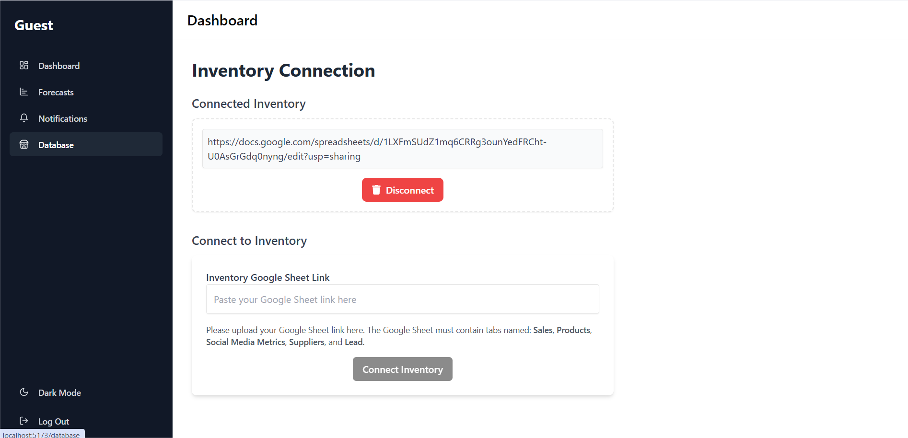
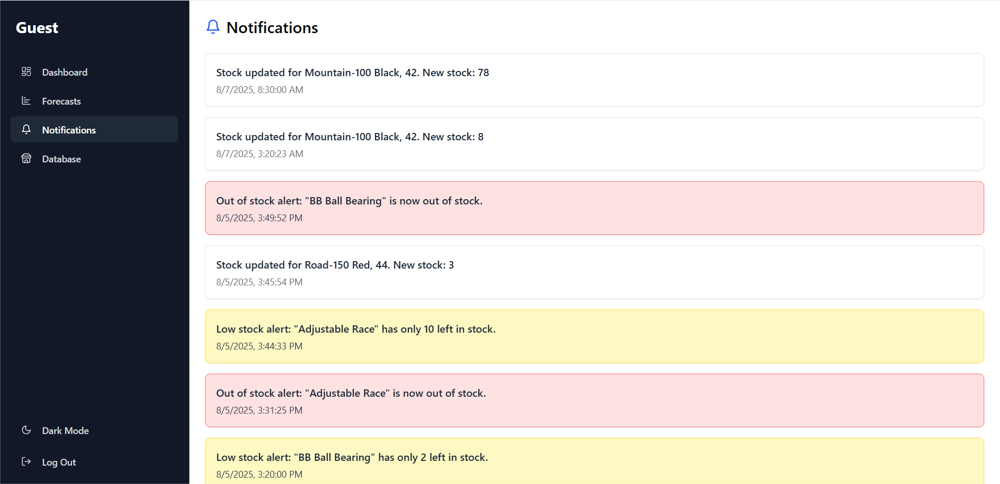
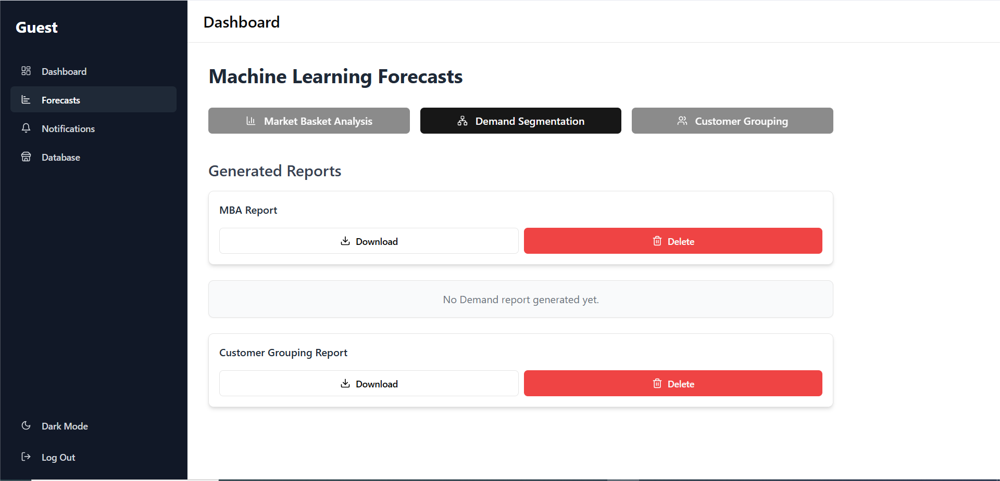
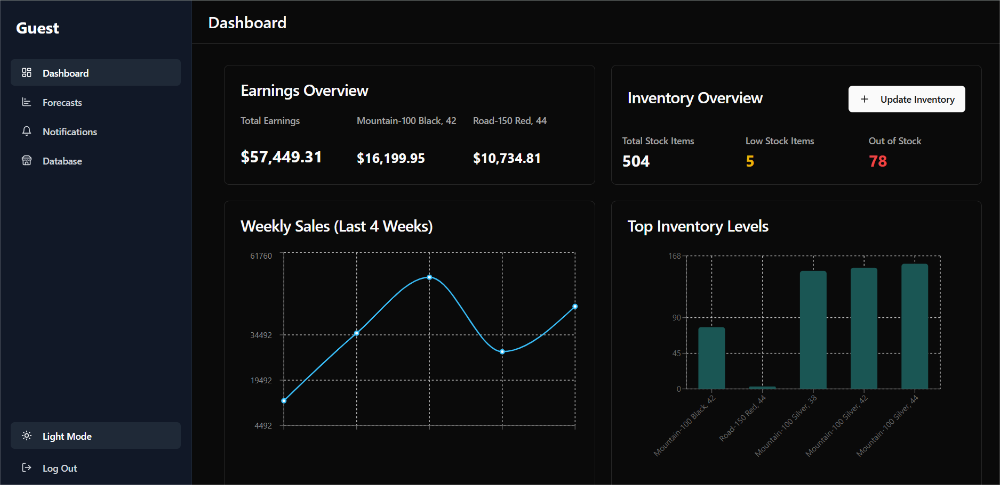

# 📊 AI-Driven Retail Dashboard

An **AI-powered inventory and forecasting system** that lets you seamlessly connect your Google Sheets inventory and get **real-time insights, notifications, and downloadable AI-generated reports** — all from one responsive, modern dashboard.

---
🔗 Live Demo: https://ai-powered-retail-dashboard-seven.vercel.app/

🔐 Demo Access

To explore the platform without connecting your own inventory, you can use the demo account below:

Email: guest1@gmail.com
Password: guest123

This account already has Google Sheet inventory connected, so you can access dashboard and reports instantly. 

## 🆕 New Users

You may also register a new account.

After registration:

Connect your Google Sheet inventory

The dashboard will automatically generate insights and forecasts

⚠️ Note: A newly registered account will show an empty dashboard until inventory data is connected.

## 🧠 Key Features

✅ Google Sheets Integration

✅ Real-time Inventory Monitoring

✅ Low Stock Notifications

✅ Real-Time Insights Dashboard

✅ Market Basket Analysis

✅ Customer Segmentation

✅ Demand Segmentation

✅ Secure User Authentication

✅ Scalable Backend Architecture

## 🛠 Tech Stack

**Frontend**
-  React.js — Component-based UI
-  Tailwind CSS — Styling
-  Recharts — Interactive charts
-  Lucide React — Icons
-  Formik — Form handling
-  Yup — Form validation
-  Axios — Request handling
- Socket io — Real Time connection

**Backend**
-  Node.js + Express.js — API server
-  Mongoose — MongoDB modeling
-  Google API — Sheets integration
-  Socket.IO — Real-time notifications

**AI/ML Service**
-  Flask — ML API
-  Pandas, NumPy — Data processing
-  ReportLab — PDF report generation
-  Custom ML models — Forecasting & insights

---

### Dashboard Overview  
Your main control center — **real-time inventory**, sales summaries, and quick access to forecasting.  

---

### Google Sheets Connection  
Easily connect your **Google Sheet** containing these tabs:  
`sales`, `clients`, `supplier`, `lead`, `products`.  
Our backend uses the Google Sheets API to sync data instantly.  

---

### Notifications System  
Get **instant alerts** when inventory is updated or when new insights are generated.  

---

### Forecast Type Selection  
Choose the type of forecast you need.  
The **sales tab** from Google Sheets is automatically exported as a CSV and sent to our **Flask AI API**.  

## Dark Mode  

---

## ⚙️ How It Works

1. **Connect Google Sheets** with required tabs.
2. Backend fetches and updates **real-time inventory**.
3. Make stock updates from dashboard → instantly syncs with Google Sheets.
4. Choose forecast type → sales data sent to Flask API.
5. Flask API returns **PDF report** with AI-generated insights.
6. Dashboard updates instantly with insights and notifications.

cd ../frontend
npm install
